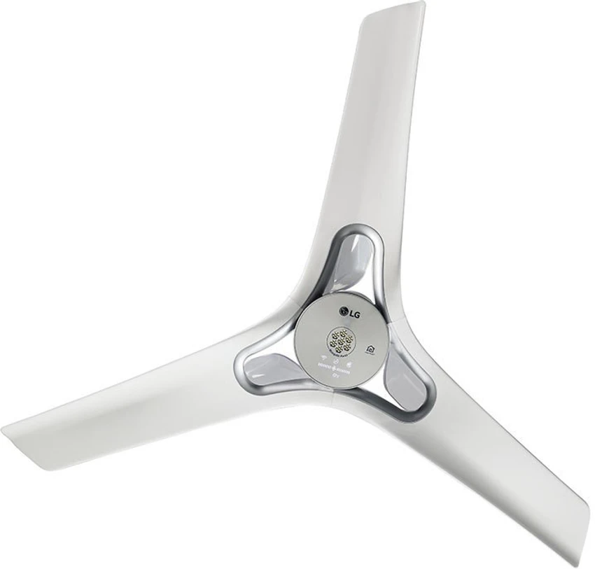

# Homebridge LG Ceiling Fan

<!-- [](https://github.com/homebridge/homebridge/wiki/Verified-Plugins) -->
[](https://www.npmjs.com/package/homebridge-lg-ceilingfan)
[](https://www.npmjs.com/package/homebridge-lg-ceilingfan)

A Homebridge plugin for controlling LG ceiling fans via the LG ThinQ platform.



## Features

- **4-Speed Discrete Control**: Shows as 4 distinct speed buttons in Home app (Off, Low, Medium, High, Turbo)
- **Power Control**: Turn ceiling fan on/off
- **Status Monitoring**: Real-time status updates from LG ThinQ
- **Automatic Authentication**: Handles LG ThinQ API authentication
- **🎯 Easy Setup**: Built-in UI for automatic LG ThinQ authentication and device discovery
- **Auto-Discovery**: Automatically discovers LG ceiling fans from your ThinQ account
- **Manual Configuration**: Configure specific devices with custom settings
- **HomeKit Integration**: Native HomeKit support through Homebridge

## Requirements

- Node.js 14.18.1 or later
- Homebridge 1.3.5 or later
- LG ThinQ account with registered ceiling fans
- LG ThinQ API v2 compatible ceiling fans

## Installation

1. Install the plugin via npm:
```bash
npm install -g homebridge-lg-ceilingfan
```

2. Or install via Homebridge Config UI X by searching for "LG Ceiling Fan"

## Easy Setup (Recommended)

### Using the Built-in Custom UI

1. Install the plugin via Homebridge Config UI X
2. Go to the "Plugins" tab and find "LG Ceiling Fan"
3. Click the **"Settings"** button
4. Click **"Plugin Config"** button (this opens the authentication interface)
5. In the Custom UI:
   - Select your country code (e.g., US, TR, KR. Must be uppercase)
   - Select your language code (e.g., en-US, tr-TR, ko-KR)
   - Enter your LG ThinQ username (email)
   - Enter your LG ThinQ password
   - Click **"Login & Get Refresh Token"**
6. Once authenticated successfully:
   - Click **"Discover Ceiling Fans"** to find your devices
   - Click **"Save Configuration"** to apply the settings
7. Restart Homebridge

The Custom UI will automatically:
- Authenticate with LG ThinQ using the working authentication flow
- Generate and save your refresh token
- Discover your ceiling fans using the correct API calls
- Configure the plugin settings with the proper device information

**Note**: The Custom UI uses the tested and working LG API commands (airState.operation for power, airState.windStrength for speed control) that were discovered through extensive testing.

## Manual Configuration

Add the following to your Homebridge `config.json`:

```json
{
  "platforms": [
    {
      "name": "LG Ceiling Fan",
      "platform": "LGCeilingFan",
      "auth_mode": "token",
      "refresh_token": "your_refresh_token_here",
      "country": "US",
      "language": "en-US",
      "devices": [
        {
          "id": "your_device_id",
          "name": "Master Bedroom Fan",
          "model": "LG Ceiling Fan",
          "enable_light": true,
          "max_speed": 5
        }
      ],
      "polling_interval": 30,
      "debug": false
    }
  ]
}
```

## Configuration Options

### Authentication

| Option | Type | Required | Description |
|--------|------|----------|-------------|
| `auth_mode` | string | Yes | Authentication method: `token` or `account` |
| `refresh_token` | string | If `auth_mode` = `token` | LG ThinQ refresh token (use UI to get automatically) |
| `username` | string | If `auth_mode` = `account` | LG ThinQ username |
| `password` | string | If `auth_mode` = `account` | LG ThinQ password |
| `country` | string | Yes | Country code (e.g., "US", "KR") |
| `language` | string | Yes | Language code (e.g., "en-US", "ko-KR") |

### Device Configuration

| Option | Type | Required | Default | Description |
|--------|------|----------|---------|-------------|
| `devices` | array | No | [] | List of devices to configure (empty = auto-discover) |
| `devices[].id` | string | Yes | - | Device ID from LG ThinQ |
| `devices[].name` | string | No | Device alias | Custom name for the fan |
| `devices[].model` | string | No | Device type | Fan model name |
| `devices[].max_speed` | number | No | 5 | Maximum fan speed (1-10) |

### Advanced Options

| Option | Type | Required | Default | Description |
|--------|------|----------|---------|-------------|
| `polling_interval` | number | No | 30 | Status update interval (seconds) |
| `debug` | boolean | No | false | Enable debug logging |

## Getting Your Refresh Token

### Method 1: Using the Built-in UI (Recommended)

The easiest way to get your refresh token is through the plugin's built-in UI:

1. Install the plugin
2. Go to plugin settings in Homebridge Config UI X
3. Click "Plugin Config"
4. Enter your LG ThinQ credentials
5. Click "Login & Get Refresh Token"
6. The token will be automatically saved to your configuration

### Method 2: Using Developer Tools

---

## Device Discovery

The plugin can automatically discover LG ceiling fans in two ways:

### Auto-Discovery (Recommended)
Use the built-in UI or leave the `devices` array empty:
1. The plugin fetches all devices from your LG ThinQ account
2. Filters devices that appear to be ceiling fans
3. Automatically configures them with default settings

## Supported Features

### Fan Control
- **Power**: Turn fan on/off
- **Speed**: 4 discrete speed steps (Off, Low, Medium, High, Turbo)

## Troubleshooting

### Common Issues

**Authentication Failed**
- Use the built-in UI for automatic authentication
- Verify your LG ThinQ credentials are correct
- Check country and language codes match your LG account
- Try using account authentication instead of token

**No Devices Found**
- Use the device discovery feature in the UI
- Ensure your ceiling fans are registered in the LG ThinQ app
- Check that devices are online and accessible
- Try specifying device IDs manually in configuration

**Device Not Responding**
- Check your internet connection
- Verify the ceiling fan is connected to WiFi
- Use the "Test Token" feature in the UI
- Increase the polling interval to reduce API load

**HomeKit Shows "No Response"**
- Check Homebridge logs for errors
- Restart Homebridge
- Verify device configuration is correct
- Use the built-in UI to test your authentication

### Debug Mode

Enable debug logging by setting `debug: true` in your configuration. This will provide detailed logs about:
- API authentication
- Device discovery
- Status updates
- Command execution

### Getting Device IDs

To find your device IDs:

1. Use the built-in UI device discovery feature (recommended)
2. Enable debug mode in the plugin configuration
3. Restart Homebridge
4. Check the logs for discovered devices
5. Use the device IDs shown in the logs

## Contributing

1. Fork the repository
2. Create a feature branch
3. Make your changes
4. Add tests if applicable
5. Submit a pull request

## License

This project is licensed under the Apache-2.0 License - see the [LICENSE](LICENSE) file for details.

## Credits

Plugin by [orkank](https://github.com/orkank/homebridge-lg-thinq-ceiling-fan)

## Disclaimer

This plugin is not officially supported by LG Electronics. It uses reverse-engineered APIs that may change without notice. Use at your own risk.

## Support

If you encounter issues:
1. Try the built-in UI for easy setup and testing
2. Check the troubleshooting section above
3. Enable debug mode and check logs
4. Search existing GitHub issues
5. Create a new issue with logs and configuration details

For questions and discussion, please use GitHub Discussions.

## Changelog

See [CHANGELOG.md](CHANGELOG.md) for version history and updates.
